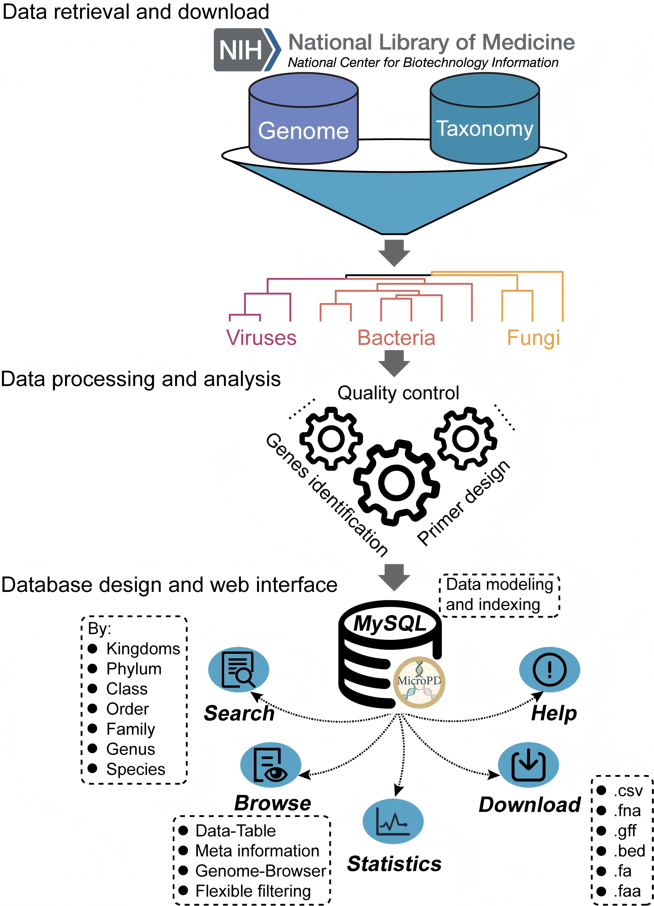

# MicroPD: a functional gene-based PCR primer database for comprehensive microbial detection



---
### 🌐 Web Interface  
🔗 [https://www.primerbanks.com/](https://www.primerbanks.com/)

## 🧬 Script Description

All scripts are located in the `scripts/` directory and are numbered according to their execution order.  
Each script handles a specific part of the MicroPD data processing workflow.

📂 *Directory structure example:*
```bash
scripts/
├── 10_filter_table_by_threshold.py
├── 11_run_prokka_annotation.sh
├── 12_fetch_cds_dna_seq_bacteria.R
├── 13_extract_long_genes.sh
├── 14_fetch_specifi_gene_fq.py
├── 15_fetch_specifi_gene_fq.sh
├── 16_merge_fa.sh
├── 17_cdhit_cluster_analysis.sh
├── 18_merge2fasta.py
└── 19_rebuild_fasta.sh
...
```

---

#### 10_filter_table_by_threshold.py  
Based on the results of the MASH algorithm, filter out similar genomes.

#### 11_run_prokka_annotation.sh  
Runs Prokka in batch mode to annotate genome files (`.fna`).  
Generates amino acid (`.faa`), nucleotide (`.ffn`), and annotation tables (`.tsv`).  
Parallel processing is used to enhance efficiency.

#### 12_fetch_cds_dna_seq_bacteria.R  
Extracts CDS DNA sequences from Prokka annotation tables (`.tsv`) and outputs FASTA files.

## Filter genes with a size greater than 10k

#### 13_extract_long_genes.sh  
Extracts gene sequences longer than 10,000 bp using `seqkit`.  
Saves the IDs of long genes to a text file, supports parallel processing.

#### 14_fetch_specifi_gene_fq.py  
Extracts specific gene sequences from FASTA files using a gene ID list.  
Outputs matching and non-matching sequences separately.

#### 15_fetch_specifi_gene_fq.sh  
Wraps `fetch_specifi_gene_fq.py` for batch processing of multiple FASTA files.  
Categorizes sequences by matching status; supports parallelization.

## Remove redundancies using Cd-hit

#### 16_merge_fa.sh  
Merges multiple FASTA files into larger batches (1000 per file).  
Temporary files are used for batch control and deleted after processing.

#### 17_cdhit_cluster_analysis.sh  
Performs `cd-hit-est` clustering for batch sequence analysis.

#### 18_merge2fasta.py  
Splits merged FASTA files into genome-specific FASTA outputs based on gene ID lists.  
Supports batch processing with flexible input/output paths.

#### 19_rebuild_fasta.sh  
Executes `merge2fasta.py` with specified environment and file paths to rebuild genome-specific FASTA files.

## Split CDS

#### 20_split_cds_to_pseudo_reads.py  
Slices each CDS into 150-bp non-overlapping pseudo reads, outputs FASTQ and read count statistics.

#### 21_run_split_cds_to_pseudo_reads.sh  
Launches `split_cds_to_pseudo_reads.py` with required parameters.

## Bowtie2

```bash
bowtie2-build -f --large-index --bmax 6635772616 --dcv 4096 --threads 28 bacteria.fna bacteria
```

#### 22_map_cds_pseudoreads_bt2.sh  
Maps CDS pseudo-reads to Bowtie2 indices; keeps uniquely aligned reads only.  
Generates SAM, aligned/unaligned FASTQ, and log files.

#### 23_fetch_specific_gene_name.py  
Extracts CDS genes whose 150-bp fragments are uniquely aligned; outputs gene ID lists.

#### 24_start_fetch_specific_gene_name.sh  
Batch script to execute `fetch_specific_gene_name.py` across datasets.

## Uniref Annotator

```bash
#Generate index file by diamond
diamond makedb --in /s3/SHARE/woodman/Prokka2/data/uniref90.fasta --db /s3/SHARE/woodman/Prokka2/dmnd_db/uniref90.dmnd
diamond makedb --in /s3/SHARE/woodman/Prokka2/data/uniref50.fasta --db /s3/SHARE/woodman/Prokka2/dmnd_db/uniref50.dmnd
```

#### 25_batch_diamond_uniref.sh  
Runs DIAMOND searches against UniRef90 and UniRef50 databases for protein annotation.

#### 26_start_mutiple.sh  
Launches parallel DIAMOND searches (two jobs × seven CPUs each) for large-scale protein annotation.

#### 27_extract_genes_to_individual_fasta.py  
Splits sequences from input FASTA into individual `{gene_id}.fasta` files.

#### 28_run_extract_genes_to_individual_fasta.sh  
Batch executes gene extraction and logs completion status.

## Primer Design

```bash
conda install -c bioconda primer3-py=0.6.1
conda install bioconda::pysam
conda install cctbx202105::biopytho
conda install pandas=1.5.3 numpy=1.21.2
```

#### 29_primer_design.py  
Designs qPCR primers using Primer3 (product sizes 100–500 bp).  
Skips sequences shorter than 100 bp and outputs CSV/log files.

#### 30_run_primer_design.sh  
Executes batch primer design with the above Python script.

#### 31_consolidate_primers.py  
Merges individual primer result CSVs, adds `GENOME_ID`/`GENE_ID`, and outputs `primer_bank_virus.csv`.

#### 32_score_primers.py  
Calculates ΔG, GC%, Tm, hairpin/self-complementarity scores, and overall primer score.

#### 33_run_score_primers.sh  
Batch runs primer scoring across all results.

#### 34_primer_merge.py  
Combines all primer CSVs into a unified bacterial primer bank.

#### 35_primer_mergeV2.py  
Improved version of primer merging; auto-completes unique indexes for KINGDOM and PRIMER_PAIR_X.

---

#### 36_gtf2json.py  
Converts GTF “gene” entries into JSONL format for database use.

#### 37_process_gff.py  
Batch converts GFF files to JSONL format, merges them into `gtf.jsonl`.

#### 38_assembly.json.merge.py  
Merges historical and current NCBI assembly summaries into unified JSONL master data.

#### 39–43_primer_merge.py  
Updates database form fields and data structure (v2 → v7).

---

#### 44_map_nt_bowtie2_unique.sh  
Maps 40k CDS pseudo-sequences against NCBI `nt` index using Bowtie2; retains uniquely aligned reads.

#### 45_merge_sam.py  
Merges SAM files from `nt` partitions (A/B), removes duplicates and non-unique alignments.

#### 46_ncbi_refseq_batch_dl_md5.py  
Performs multi-threaded batch download of NCBI RefSeq genome reports; validates MD5 checksums.

#### 47_sam_to_region_primer_index.py  
Parses SAM alignment files to generate genome-specific region–primer indexes (JSON/TSV/PKL).

#### 48_sam_to_region_primer_index_v2.py  
Enhanced version supporting comprehensive summary tables across all genomes.

#### 49_merge_seq_reports_index.py  
Aggregates sequence report JSONLs, deduplicates by GenBank accession, and outputs summary indexes.

## Generate Download File

#### 50_parallel_tar_taxid_dirs.sh  
Packages all subdirectories under `temp_fna_taxid/` into `{taxid}.fna.tar.gz` archives.

#### 51_generate_6format_taxid_packages.py  
Generates six downloadable formats (CSV, FAA, FA, FNA, GFF→BED, etc.) by TAXID with missing record alerts.

---

✅ **Resulting directory example:**
```bash
mate_virus/
├── bed_taxid/
├── csv_taxid/
├── faa_taxid/
├── fa_taxid/
├── fna_taxid/
└── gff_taxid/
```

Example files:
```bash
csv_taxid/
├── 1000373.csv.gz
├── 1000646.csv.gz
└── 1001080.csv.gz

gff_taxid/
├── 1000373.gff.tar.gz
└── 1001080.gff.tar.gz

fna_taxid/
├── 1000373.fna.tar.gz
└── 1001080.fna.tar.gz
```
